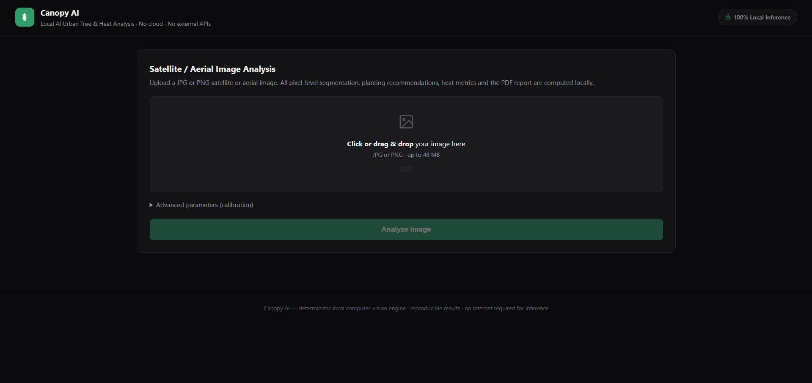
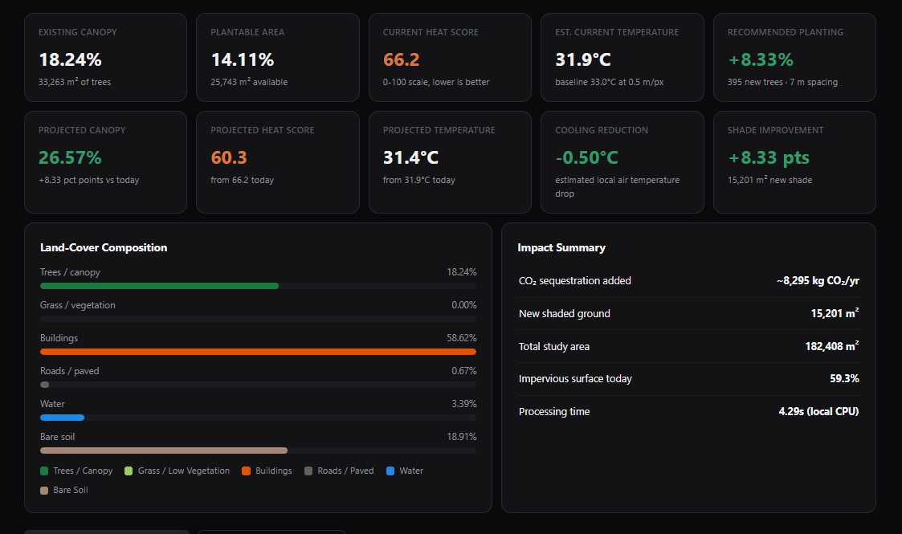
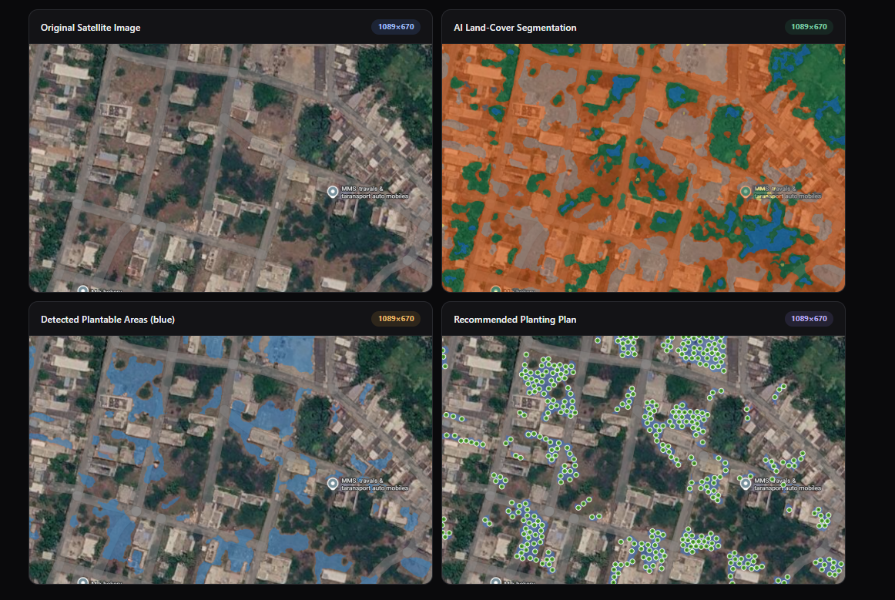
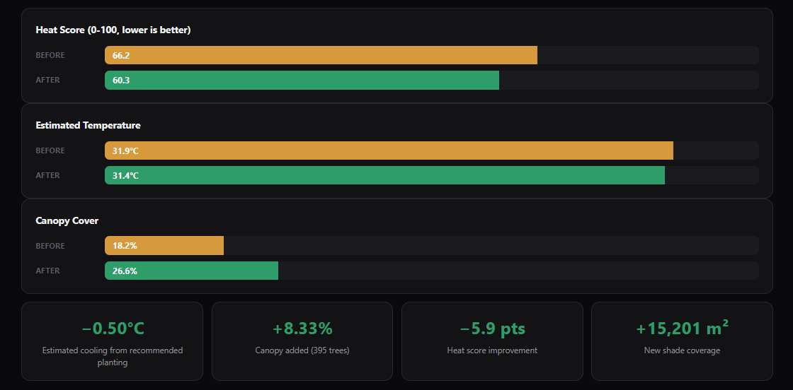

# Canopy AI

Fully local AI-powered urban tree canopy and heat analysis. Upload a satellite or
aerial image (JPG/PNG) and Canopy AI performs pixel-level land-cover segmentation,
detects plantable areas, generates a recommended planting plan with realistic tree
spacing, computes heat metrics with before/after projections, and exports a
professional PDF report.

**No VLMs, no LLMs, no external AI APIs, no cloud services, no map APIs.** Per-pixel
classification is a small locally-trained Random Forest (scikit-learn, ~11 MB, trained
entirely on synthetic labeled scenes - see [Training the model](#training-the-model)),
followed by classical computer-vision post-processing. Everything runs on your CPU.
Results are deterministic and reproducible (fixed random seed for tree placement).

## Screenshots

| | |
|---|---|
|  |  |
|  |  |

## Quick start

### One-click launch (Windows)

Double-click **`run_canopy.bat`** - it checks Python, installs dependencies on first
run, opens the browser and starts the server. Use **`stop_canopy.bat`** to stop it.

### Manual launch

```powershell
pip install -r requirements.txt
python app.py
```

Open http://127.0.0.1:7860 in your browser - upload an image in the dropzone,
adjust calibration if needed, and browse the dashboard tabs (overview, analysis
maps, before/after, methodology, PDF download). The server binds to localhost
only; nothing leaves your machine.

## How it works

1. **Segmentation** (`engine/segmentation.py`, `engine/features.py`) - an edge-preserving
   bilateral filter stabilises spectra; every pixel is scored with vegetation indices
   (ExG, VARI), HSV hue/saturation/value, RGB and an 11x11 local texture statistic. A
   locally-trained Random Forest classifier (`engine/model/land_cover_rf.joblib`) assigns
   trees, grass, buildings, roads/paved, water and bare/open soil from those 9 features.
   SLIC superpixels then aggregate labels into perceptually uniform regions; a majority
   (mode) filter removes salt-and-pepper noise; connected-component analysis deletes
   regions below 0.02% of the scene; shadow spectra are re-assigned by hue/saturation-
   weighted neighbourhood voting; compact-vs-elongated shape analysis separates buildings
   from road segments. All masks keep the original image resolution and align 1:1 with
   input pixels.
2. **Plantable mask** (`engine/planting.py`) - grass + bare-soil pixels with an exact
   Euclidean distance-transform buffer of 1.5 m around trees, buildings and roads
   (2.5 m around water). Fragments below 0.04% of the scene are discarded as noise.
3. **Tree placement** - deterministic Bridson Poisson-disk sampling inside the
   eroded plantable mask enforces strict minimum spacing, so markers never
   overlap existing trees, buildings or roads.
4. **Metrics** - percentages come from actual pixel counts at the configured
   ground resolution (m/pixel). Heat score = clamp(18 + 0.90*impervious% +
   0.40*bare% - 0.70*canopy% - 0.20*grass%, 0-100). Temperature = baseline
   - 0.06 degC per canopy % point (published urban-forestry range 0.04-0.10).
5. **PDF report** (`engine/report.py`) - original image, AI segmentation,
   plantable-area image, planting plan, all metrics, before/after heat
   comparison, methodology and environmental impact (CO2, shade).

## Configurable parameters (Advanced section in the UI)

| Parameter | Default | Meaning |
|---|---|---|
| Baseline temperature | 33 degC | Regional baseline used by the heat model |
| Ground resolution | 0.5 m/px | Ground sample distance of the image |
| Tree spacing | 7 m | Minimum distance between planted trees |
| Mature crown radius | 3.5 m | Crown size used for projected canopy |

## Training the model

`engine/model/land_cover_rf.joblib` is committed to the repo, so a normal clone needs
no training step. To retrain it (e.g. after changing `engine/features.py` or the
synthetic generator):

```powershell
python engine\train_model.py
```

This generates ~16 synthetic scenes on the fly (`tests/make_test_image.py`, each with
randomized hue/saturation/brightness jitter), using the exact per-pixel ground truth the
generator draws (every building/road/tree/water/soil primitive is mirrored onto a label
canvas as it's rendered - no manual labeling involved), trains a
`RandomForestClassifier`, reports held-out pixel accuracy on unseen jittered seeds, and
overwrites the `.joblib` file. No real satellite imagery is used or required - this is a
genuine limitation: the classifier has only ever seen synthetic renders, so it won't
generalize as well to real photographs as a model trained on real labeled imagery would.

## Tests

```powershell
python tests\make_test_image.py   # generate synthetic satellite image
python tests\test_engine.py       # engine validation (masks, spacing, metrics, PDF)
python tests\test_api.py          # HTTP API end-to-end
```

## Outputs

Each analysis is stored under `outputs/<analysis_id>/`:
`original.png`, `segmentation.png`, `plantable.png`, `recommendation.png`,
`report.pdf`.
